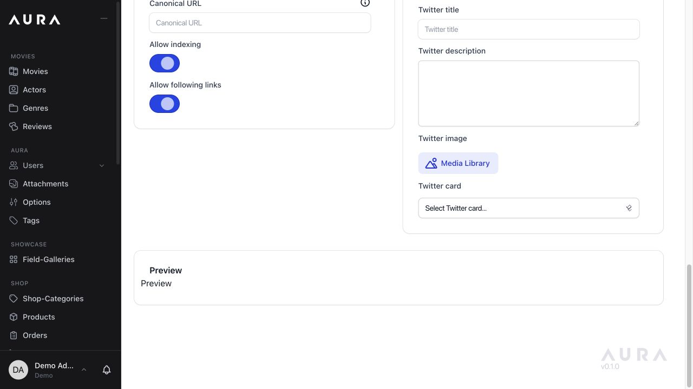
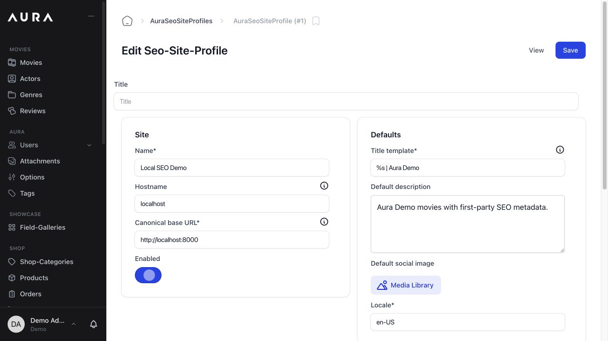
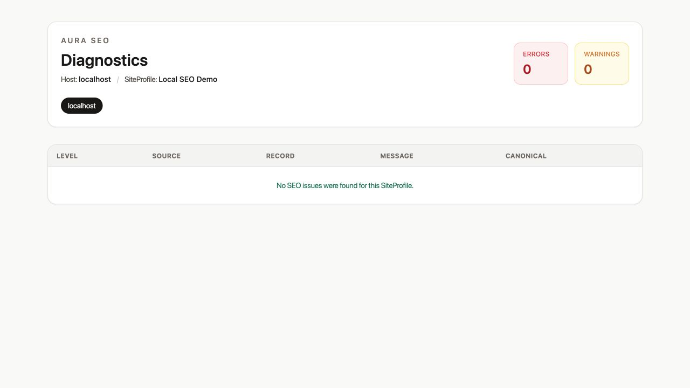
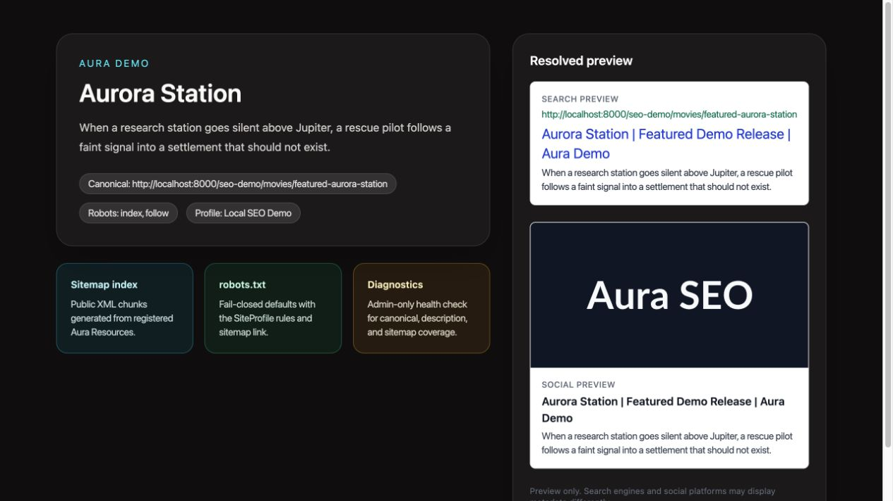

# Aura SEO

Aura SEO is the free, MIT-licensed SEO essentials package for Aura CMS. It
keeps public exposure explicit and fail-closed: installing the package does not
publish any Resource, generate any sitemap entry, or render any frontend
metadata until the host application opts in.

Aura Base is the only required Aura package. Aura Redirects stays optional and
is not imported or required by production code.

## Screenshots

### Resource editor with the reusable SEO field group



### SEO settings



### Settings diagnostics



### Public resolved preview



## Features

- one SEO settings tab per Team for canonical URL, robots defaults, title
  patterns, locale, and social-image defaults
- reusable `SeoFieldGroup` built only from existing Aura fields
- deterministic metadata resolution order: record override → Resource mapping →
  SEO settings → application fallback
- automatic new-record titles from `[Post Title] [Separator] [Site Name]`
- AI-assisted meta title and description generation through Aura's core AI
  connector
- canonical URL normalization with fail-closed external canonical rejection by
  default
- Blade metadata renderer and in-editor search/social previews
- explicit sitemap registry with chunked XML generation
- explicit `robots.txt` generation with safe directive sanitization
- cache reuse plus automatic invalidation on SEO settings or registered Resource
  changes
- diagnostics embedded in the SEO settings tab plus a CLI command for
  canonical, description, and sitemap coverage
- Team-aware hostname isolation and permission-aware public boundaries
- admin gates and permission catalog for SEO management and diagnostics

## Requirements

- PHP 8.4+
- Aura CMS 2.x
- Laravel 12 or 13
- Livewire 4
- PHP XMLWriter extension

## Installation

Install the package and publish its configuration:

```bash
composer config repositories.aura-seo vcs git@github.com:eminiarts/aura-seo.git
composer require eminiarts/aura-seo:^1.0
php artisan vendor:publish --tag=aura-seo-config
```

The package provider is discovered automatically.

## Fail-closed defaults

Aura SEO is intentionally inert after install:

- SEO output is disabled in settings
- no Aura Resource is public
- no sitemap source exists
- unknown hosts receive deny-all `robots.txt`
- unregistered Resources resolve to `noindex, nofollow` with no canonical URL

To expose anything publicly, the host must do two things:

1. enable SEO and save a canonical base URL under **Settings → SEO**
2. register each public SEO Resource explicitly

## SEO settings

Aura SEO registers a standard settings tab under `/admin/settings`. Each Team
stores one profile containing its site name, canonical base URL, separator,
title pattern, default description, Open Graph and Twitter images, locale, and
robots behavior. Diagnostics appear at the bottom of the same tab and inspect
the last saved values.

The hostname is derived from the canonical base URL. With Teams enabled,
settings and public resolution remain Team-isolated. The old `sites` mapping
and `SiteProfile` records are read-only migration fallbacks for existing
installations; new installations do not register the resource in Aura.

## Registering Resources

Register public SEO behavior with `SeoResourceDefinition` entries in
`config/aura-seo.php`:

```php
use App\Aura\Resources\Article;
use Aura\Seo\Data\SeoResourceDefinition;
use Aura\Seo\Data\SiteProfileData;

'resources' => [
    fn (): SeoResourceDefinition => SeoResourceDefinition::make('articles', Article::class)
        ->title('title')
        ->description('excerpt')
        ->image('seo_og_image')
        ->lastModified('updated_at')
        ->url(fn (Article $article): string => route('articles.show', ['article' => $article->slug], false))
        ->publicIndex(
            fn (SiteProfileData $site) => Article::query()->where('team_id', $site->teamId),
            fn (Article $article, SiteProfileData $site): bool => (int) $article->team_id === $site->teamId,
        )
        ->sitemap(),
],
```

Public enumeration always requires both halves of the boundary:

- a query that defines which records may be enumerated
- a record-level visibility predicate used again during resolution

If either side is missing, Aura SEO does not infer public exposure.

## Reusable SEO field group

Add the packaged SEO fields to any Aura Resource:

```php
use Aura\Seo\Fields\SeoFieldGroup;

public static function getFields(): array
{
    return array_merge([
        // existing Aura fields...
    ], SeoFieldGroup::make());
}
```

The field group includes:

- SEO slug
- meta title and description
- **Pre-fill with AI**, using the current record title/content and the AI
  provider configured under **Settings → AI**
- canonical override
- robots index/follow toggles
- Open Graph title, description, and image
- Twitter title, description, image, and card
- resolved preview panel

## Rendering metadata

Resolve metadata for the current record and host:

```php
use Aura\Seo\Contracts\SiteProfileResolver;
use Aura\Seo\Services\MetadataRenderer;
use Aura\Seo\Services\MetadataResolver;

$profile = app(SiteProfileResolver::class)->resolve(request()->getHost());

abort_if($profile === null, 404);

$metadata = app(MetadataResolver::class)->resolve($article, $profile);
```

Render it inside your own layout or view:

```blade
{!! app(\Aura\Seo\Services\MetadataRenderer::class)->render($metadata) !!}
```

Aura SEO renders tags only. It never takes control of the page layout, route,
or response body.

## Public routes

When enabled, Aura SEO registers:

```text
GET /sitemap.xml
GET /sitemap/{source}-{page}.xml
GET /robots.txt
```

The authenticated editor also uses `POST /admin/seo/ai-metadata` to request AI
suggestions. The endpoint is permission-checked and rate-limited.

Important host note: a real `public/robots.txt` file will be served by the web
server before Laravel sees the request. If you want Aura SEO's generated
`robots.txt`, do not ship a conflicting static file.

## Permissions and commands

Default permission slugs:

- `manage-aura-seo`
- `diagnose-aura-seo`

Commands:

```bash
php artisan aura-seo:diagnose --host=www.example.com
php artisan aura-seo:sync-permissions
```

Global Admins and Super Admins always pass the packaged SEO gates. Other users
must have the configured permission slugs.

## Configuration notes

- `canonical.allow_external` defaults to `false`
- `canonical.trailing_slash` controls normalized canonical output
- `settings.*` supplies initial values for the standard SEO settings tab
- `fallbacks.*` apply only after record, Resource, and SEO settings values are
  exhausted
- `routes.*` toggles the sitemap and robots endpoints
- `cache.ttl` controls sitemap, robots, and metadata cache lifetime
- `sitemap.chunk_size` controls XML page splitting

For Aura `Image` fields, store normal Aura image values. If you want to emit an
absolute CDN or external image URL, return it from your Resource mapping or
application fallback instead of writing an arbitrary string into an Aura image
field.

## Demo verification

Aura SEO was exercised in a live Aura demo installation with:

- Team-scoped SEO settings
- the reusable `SeoFieldGroup` added to the demo `Movie` Resource
- a public movie page resolved through `MetadataResolver`
- working sitemap, robots, embedded diagnostics, and admin settings

The live demo check also caught and fixed a preview partial regression where
plain included Blade views could pass array-style attributes into the preview
template.

## Quality and release gate

Run the release gate before tagging:

```bash
composer validate --strict --no-check-publish
composer audit --locked --no-interaction
vendor/bin/pint --test
vendor/bin/phpstan analyse --memory-limit=1G --no-progress
vendor/bin/pest --no-coverage
```

## License

MIT. See [LICENSE.md](LICENSE.md).
